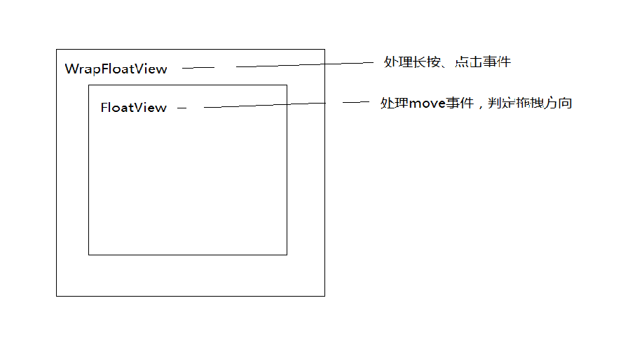
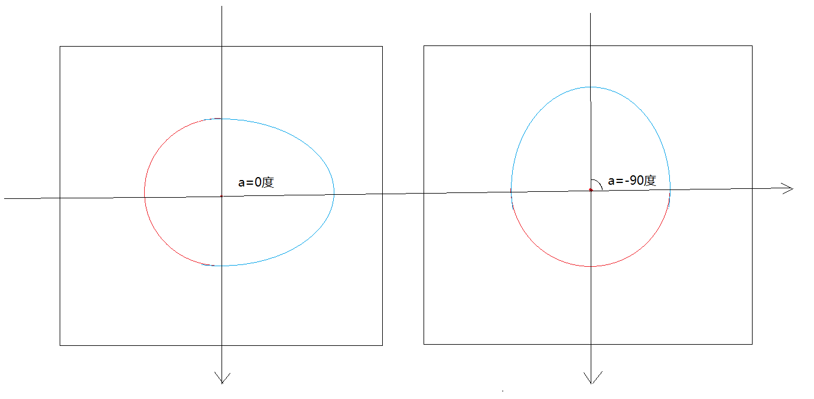
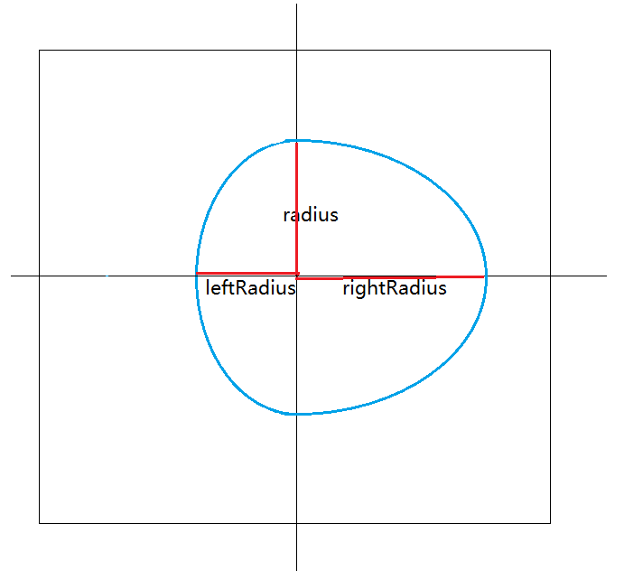
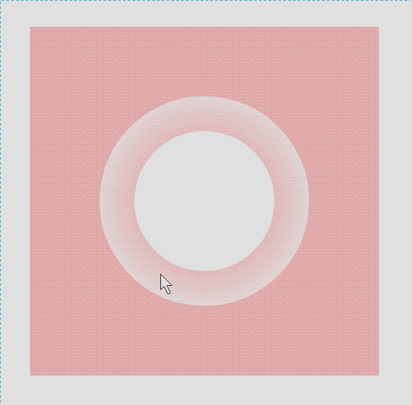
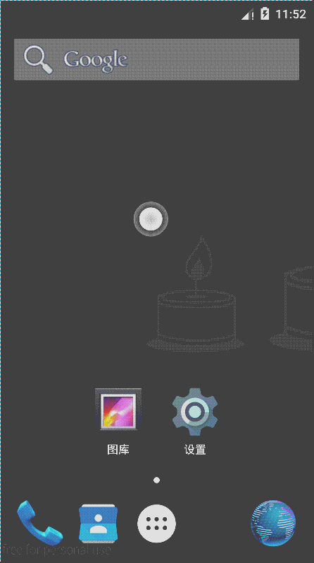

# FloatingView

### 响应操作有5种：
* CLICK		点击操作
* LEFT		向左拖拽
* UP		向上拖拽
* RIGHT		向右拖拽
* DOWN		向下拖拽

### View布局结构
外面一个WarpFloatView
里面一个FloatView

### 事件处理
* WrapFloatView处理长按、点击事件
* FlatView处理move事件，并判断拖拽方向

### 绘制解析

该效果中有两个圆球，这里定义为Ball类，有两个继承类：
* OutterBall	记录外面圆球参数
* InnerBall		记录里面圆球参数

**Ball**类负责根据当前圆球的参数绘制圆球。有如下参数：
* mParentCenter	FloatView的中心点
* mCenter		Ball的中心点
* mRadius		垂直方向半径
* mLeftRadius	左半径
* mRightRadius	右半径
* mAngle		绘制时，画板的旋转角度

示意图如下:

普通效果图:

悬浮效果图

